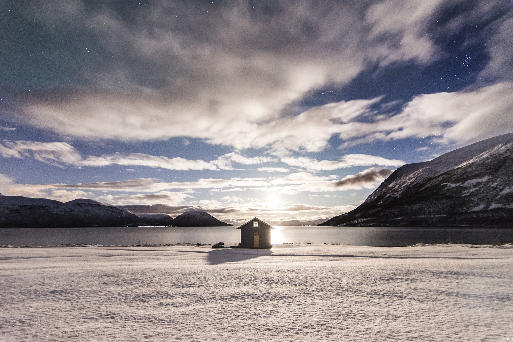

Image by <a href="https://pixabay.com/photos/?utm_source=link-attribution&amp;utm_medium=referral&amp;utm_campaign=image&amp;utm_content=1149223">Free-Photos</a> from <a href="https://pixabay.com/?utm_source=link-attribution&amp;utm_medium=referral&amp;utm_campaign=image&amp;utm_content=1149223">Pixabay</a>

### Collaborators
- [Sapna Sharma](https://sharmalab.wordpress.com/) (York University)
- [Alessandro Filazzola](https://www.filazzola.info/) (York University & University of Toronto)
- M. Arshad Imrit (York University)
- Kevin Blagrave (York University)
- Harrie-Jan Hendricks Franssen (Forschungszentrum Jülich)


### Last ice-cover event for eastern North America. 

```{r warning=FALSE, message=FALSE}
library(tidyverse)
library(rgdal)
library(spdep)
library(leaflet)


## make a lake icon
lakeIcons <- iconList(
  lake = makeIcon("lake.png", "lake2x.png",  40, 40)
)

## Load data
lakes <- read.csv("ice_free_predictions.csv") %>% filter(Pour_long < -59) %>% filter(Pour_long > -95)

## Plot lakes
leaflet(data=lakes) %>% addTiles() %>% 
  addMarkers(~Pour_long, ~Pour_lat, popup = ~as.character(rcp85), label = ~as.character(rcp85))


```